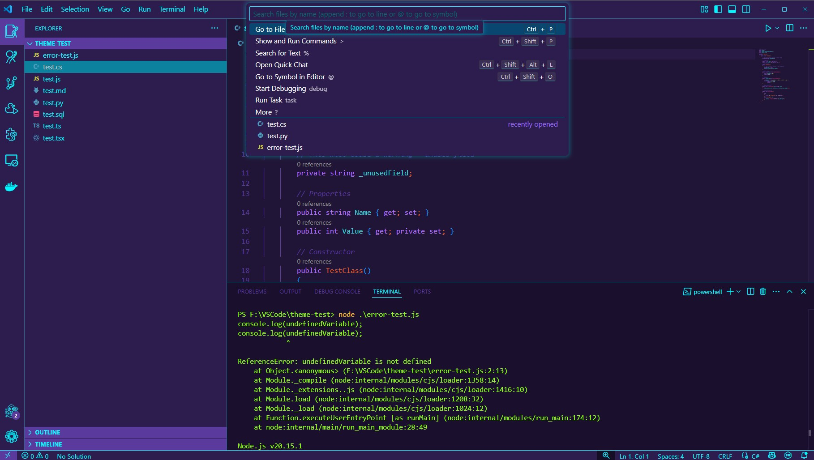

# 🐙 Code Kraken™ Theme
![Code Kraken™ Approved](https://img.shields.io/badge/Code_Kraken™_Approved!-purple?style=plastic&logo=data%3Aimage%2Fsvg%2Bxml%3Bbase64%2CPHN2ZyB4bWxucz0iaHR0cDovL3d3dy53My5vcmcvMjAwMC9zdmciIHdpZHRoPSIxMzY1LjMiIGhlaWdodD0iMTM2NS4zIiB2aWV3Qm94PSIwIDAgMTAyNCAxMDI0Ij48cGF0aCBkPSJNNDc5IDI4YTE2NCAxNjQgMCAwIDAtNTIgMTkgMzA1IDMwNSAwIDAgMC03NSA0OSA0NzMgNDczIDAgMCAwLTk2IDEwOSA2MTUgNjE1IDAgMCAwLTI0IDU1IDEzOSAxMzkgMCAwIDAtOCAyOCAzMDUgMzA1IDAgMCAwIDEgMTAwbDIgMTFhMTU0IDE1NCAwIDAgMCAxMCAyOCAxNTAgMTUwIDAgMCAwIDE5IDM2bDggMTEgNSA3IDIgMnYzbC0yIDItOCA1LTEyIDljLTUgMy03IDQtMjQgMTlhNDIzIDQyMyAwIDAgMC03NiAxMDBjLTggMTYtOCAxNi0xMyA1LTItNS0yLTctMi0xNyAwLTEyIDAtMTYgNi0zMWw3LTE1IDI2LTUyYzQtOCA4LTI3IDgtMjktMS0xIDAtMyAxLTMgMy0zIDQtMzIgMi00Ni0yLTE3LTExLTM5LTE3LTQzbC0xLTItMi0zLTMtNGE2MyA2MyAwIDAgMC0yMC0xNiA3OCA3OCAwIDAgMC0zMC0xMmwtMjAtMWMtMTYgMC0xNyAwLTI3IDNzLTIxIDktMjYgMTVjLTQgNC05IDEyLTkgMTRsLTIgOGMtMSA1LTEgNyAxIDEzbDMgNyAzIDRjMyA3IDEzIDEyIDIzIDE0IDE0IDIgMjEgNCAyMyA2IDMgMiA0IDggNCAxMyAwIDYtNCAyMS04IDI5LTYgMTItOCAxNS0xNyAyN2wtMTAgMTEtMTggMjYtNiA5LTggMTYtNyAxNC03IDI4Yy0yIDE1LTEgNDQgMyA1NmExNjQgMTY0IDAgMCAwIDcxIDk2bDIgMiA1IDJjNCAzIDIyIDExIDI2IDEybDMgMSAzIDI1IDMgMTFjNSAxNyAxOCAzMiAzNyA0M2E5NiA5NiAwIDAgMCAyNSAxMmwxNyAzaDJsNiAxIDcgMXYxM2MwIDExIDAgMTMgMiAxOGwzIDUgMSAyYzAgMiA1IDExIDkgMTRsMTAgOCAxMSA3YTQzNyA0MzcgMCAwIDEgMTggMTFsMTIgNWE3NiA3NiAwIDAgMCAxNCA2IDQxNyA0MTcgMCAwIDAgMTM2IDMybDE3IDJoODlsMjAtMiAyNS00YTQwMiA0MDIgMCAwIDAgMTE0LTM3YzIgMSAyNC0xMyAzNC0yMSA5LTggMTAtOSAyMC03YTE4NCAxODQgMCAwIDAgMTAzLTEzYzItMiAxNy03IDIxLTggNiAwIDcgMSAxMSA5IDYgMTcgMTMgMjcgMTggMjdsNCAyYzIgMiAzIDIgNiAyaDRjMCAyIDE1LTIgMjItNiA2LTQgNy01IDEwLTEwIDgtMTEgMTItMjYgMTAtNDAgMC03LTItMTQtMy0xNGwtMS00YzAtNC01LTE3LTEwLTI0LTktMTEtMjEtMjEtMzUtMjZsLTctMyAzLTJhMTgxIDE4MSAwIDAgMCA3MS03NWwyLTZ2LTFsOC0xOGEyMDcgMjA3IDAgMCAwIDYtODNsLTEtMXYtMWM0IDAtNi0zNS0xNC01NC00LTktMTQtMjUtMTktMzJsLTctOGMtMy02LTI4LTMwLTMyLTMybC0zLTJoMmw4LTEgMTAtMyAzNC0xN2M3LTQgMjEtMTcgMjctMjVsMTAtMTdjMTEtMjAgMTgtNTkgMTQtNzlhMTAzIDEwMyAwIDAgMC02LTI1YzAtOC0xMC0yMi0xOC0yNmwtOC0xYy0xMCAwLTEzIDItMjUgMTNsLTEyIDExIDEtN2MyLTUgMi0xMiAzLTIzIDAtMTcgMC0yMy0zLTIzdi0yYzEtMSAxLTMtMS04LTMtMTItMTAtMjItMTgtMzEtOC03LTE3LTEzLTE3LTExbC0zLTFjLTMtMy0xNC03LTE3LTdoLTNsLTExLTEtMTIgMWgtM2MtMyAwLTEzIDMtMjEgN2E3MCA3MCAwIDAgMC0zMiA0OGMtMiAxMC0yIDEwLTcgMTItMTEgNS0yMiAxNS0yNiAyMy0zIDYtMyAyMiAwIDI4czExIDE0IDE3IDE3bDQgMS0yIDNjLTUgOC05IDE4LTEyIDI5cy0zIDEyLTMgMjhhNjcgNjcgMCAwIDAgMyAyN2wyIDMgMSAyYy0xIDEgMCA0IDIgN2wzIDUtMyA2Yy0zIDktNCAyNi0xIDQyczEwIDM1IDIwIDUxbDE4IDI1YzggMTAgMTYgMjUgMjAgMzkgNiAyMSA1IDQ0LTMgNjBhNDMgNDMgMCAwIDEtMTggMjBsLTMgMmgtM3YtMjVhMTg1IDE4NSAwIDAgMC0yLTMxIDE4NyAxODcgMCAwIDAtMTctNTcgMTgzIDE4MyAwIDAgMC04Mi05N2MtNy00LTktNi04LThhMjYzIDI2MyAwIDAgMCAzMi01Nmw2LTE0YTIzMyAyMzMgMCAwIDAgMTMtMTE4Yy0zLTIxLTUtMzEtNy0zMXYtMWwtMi05LTctMTktMS0zLTEtMy0xLTJhMjc5IDI3OSAwIDAgMC00Ny03OWwtNy04LTYtNS0yLTJjMC0yLTUtNy0xOC0yMGEzMTYgMzE2IDAgMCAwLTQyLTM2bC0xNC0xMC0xMi05LTctNC02LTMtNC0yLTMyLTE2YTExNSAxMTUgMCAwIDAtMzktMTBjMC0xLTIwLTEtMzEgMXoiLz48L3N2Zz4%3D&logoColor=blue&color=%235A3A9C&link=https%3A%2F%2Fwww.thecodekraken.com)
> Debugging the multiverse — one commit at a time.

**Code Kraken™ Theme** is a dark, cyberpunk-inspired Visual Studio Code theme and icon kit designed for developers who thrive in chaos, coffee, and cursed Git branches. Featuring a meticulously tuned color palette and a custom product icon font built around the Code Kraken™ mascot.

---

## ✨ Features

- Dark theme optimized for code clarity and minimal eye strain
- Kraken-styled syntax highlighting for dozens of languages
- Custom **product icons** for:
  - Explorer
  - Search
  - Source Control
  - Extensions
  - Run & Debug
  - Settings
  - Accounts
- Matching Kraken terminal, UI, and tab colors
- Glowing “V” hoodie energy included

---


## 🪲 Error & Warning Highlighting

In the spirit of Code Kraken™’s debugging ritual, **all errors and warnings are highlighted in Rubber Ducky Yellow** <span style="display:inline-block;width:16px;height:16px;background-color:#fbc02d;border-radius:3px;"></span> (`#fbc02d`).

| Message Type | Color     | Hex | Purpose                |
| ------------ | --------- | --------- | ---------------------- |
| ⚠ Warnings  |<span style="display:inline-block;width:16px;height:16px;background-color:#fbc02d;border-radius:3px;"></span>| `#fbc02d` | Catch cautionary hints |
| ❌ Errors     | <span style="display:inline-block;width:16px;height:16px;background-color:#fbc02d;border-radius:3px;"></span>| `#fbc02d` | Flag terminal mistakes |


> The rubber duck is watching — speak your bugs aloud.

This visual choice aligns with the Kraken’s coding companion, the ever-present duck, reinforcing the idea that sometimes the act of explaining your code out loud is all you need to fix it.

---


## 🧪 Preview



---

## 🎨 Syntax Highlights

| Scope                      | Color     | Hex       | Description                       |
|----------------------------|-----------| ----------| ----------------------------------|
| `keyword`, `operator`      |<span style="display:inline-block;width:16px;height:16px;background-color:#b271ff;border-radius:3px;"></span>| `#b271ff` | Logical/bitwise/JS control flow   |
| `variable.language`        |<span style="display:inline-block;width:16px;height:16px;background-color:#e96530;border-radius:3px;"></span>| `#e96530` | Built-in language variables       |
| `string`                   |<span style="display:inline-block;width:16px;height:16px;background-color:#e6bbff;border-radius:3px;"></span>| `#e6bbff` | Strings and text                 |
| `constant.numeric`         |<span style="display:inline-block;width:16px;height:16px;background-color:#cbfe87;border-radius:3px;"></span>| `#cbfe87` | Numbers and enums                 |
| `comment`                  |<span style="display:inline-block;width:16px;height:16px;background-color:#5a3a9c;border-radius:3px;"></span>| `#5a3a9c` | Comments with a muted tone        |
| `support.function.console` |<span style="display:inline-block;width:16px;height:16px;background-color:#db3c80;border-radius:3px;"></span>| `#db3c80` | Console/logging statements        |
| `entity.name.class`        |<span style="display:inline-block;width:16px;height:16px;background-color:#e96530;border-radius:3px;"></span>| `#e96530` | Class and type declarations       |

---

## 🧩 Custom Product Icon Theme

| View                        | Icon                                        |
|----------------------------|---------------------------------------------|
| Explorer                   | Tentacled folder icon                       |
| Search                     | Tentacle wrapped magnifying glass           |
| Source Control             | Branching diagram with suckers              |
| Extensions                 | Puzzle piece with Kraken grip               |
| Run & Debug                | Rubber ducky with a play button             |
| Settings                   | Suction-cup style gear                      |
| Accounts                   | Minimalist Kraken avatar in hoodie          |

> Powered by a custom `.woff` icon font — no SVG hacks.

---

## 📁 Folder Structure (for devs)

```plaintext
code-kraken-theme/
├── fonts/                        # Icon font and selection.json
├── icons/product/               # Original and final Kraken SVG icons
├── themes/code-kraken-color-theme.json
├── themes/code-kraken-product-icon-theme.json
├── images/theme-screenshot.jpg
├── package.json
└── README.md
````

---

## 🔧 Installation

1. Open **Extensions** panel in VS Code
2. Search for `Code Kraken Theme`
3. Click **Install**
4. Press `Ctrl+K Ctrl+T` and choose **Code Kraken™ Theme**
5. Press `Ctrl+Shift+P`, then select:
   **Preferences: Product Icon Theme → Code Kraken Icons**

---

## 📦 Manual Install (Dev)

If you're testing locally:

```bash
git clone https://github.com/your-user/code-kraken-theme
cd code-kraken-theme
npm install -g vsce
vsce package
code --install-extension code-kraken-theme-0.0.1.vsix
```

---

## 🐙 About Code Kraken™

Code Kraken™ is a cyber-octopus mascot born from late-night deploys, terminal rituals, and chaotic dev memes. He has no mouth — only expressive eyes, a hoodie, a duck, and six restless limbs trying to make sense of Git.

---

## 📜 License

This theme and all Code Kraken™ assets are licensed under the  
**Creative Commons Attribution-NonCommercial-NoDerivatives 4.0 International License**.

You may use this extension personally and share it unmodified,  
but you may not remix, redistribute modified versions, or use it commercially.

🔗 [Full License Terms](https://creativecommons.org/licenses/by-nc-nd/4.0/)  
📧 For commercial inquiries, contact Zachery Charles Vanderford.

© Zachery Vanderford. All rights reserved.


---

## 🧼 Trademark Notice

**Code Kraken™** is a trademark of Zachery Charles Vanderford.
All rights reserved. This theme and mascot are part of an original character universe.


